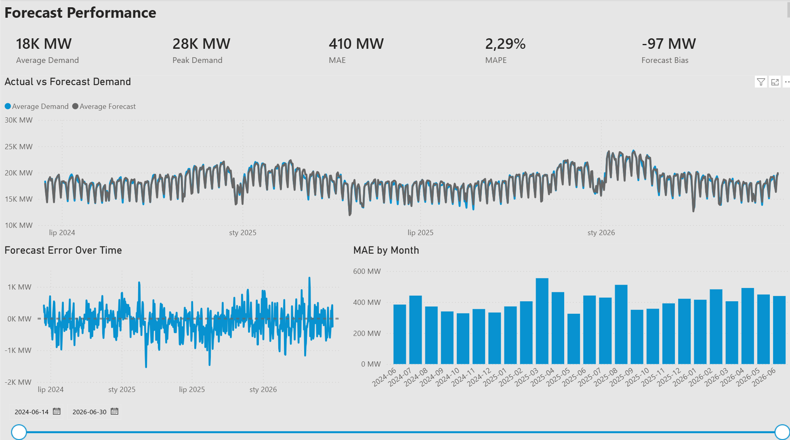
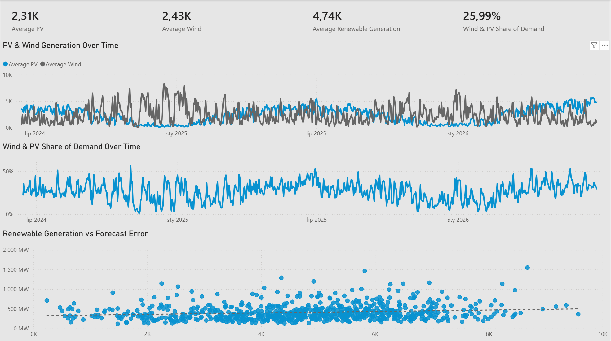
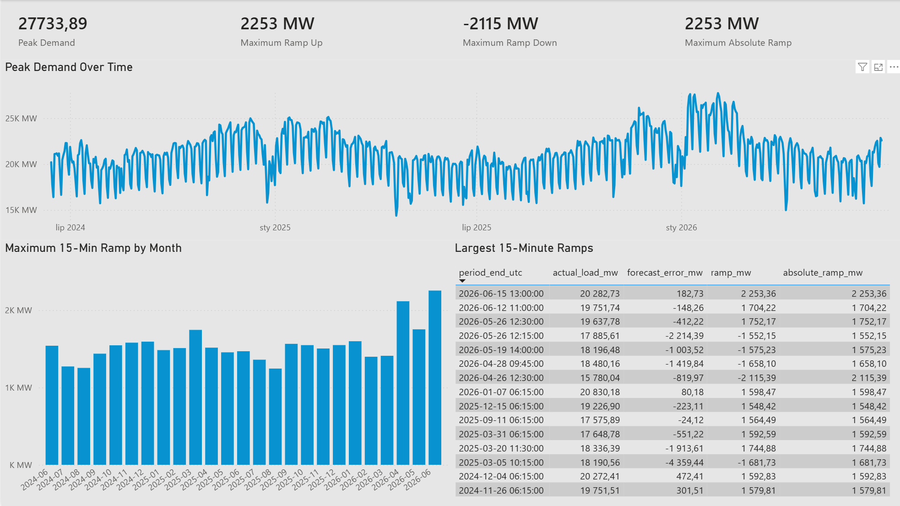

# Polish Power System Analytics

Power BI and PostgreSQL portfolio project analyzing electricity demand forecast accuracy, demand peaks, 15-minute ramps, and wind/PV generation in the Polish power system.

The project uses official data published by **Polskie Sieci Elektroenergetyczne (PSE)**.

## Project Goal

The main goal of the project is to evaluate the quality of electricity demand forecasts and identify periods in which forecast accuracy deteriorates.

The analysis focuses on:

- actual vs forecast electricity demand,
- forecast error and systematic bias,
- periods with the highest forecast errors,
- electricity demand peaks,
- 15-minute demand ramps,
- wind and photovoltaic generation,
- relationship between renewable generation and forecast accuracy.

## Business Context

The dashboard is designed from the perspective of a power demand forecasting analyst.

It supports questions such as:

- How accurate are electricity demand forecasts?
- Does the forecast systematically overestimate or underestimate demand?
- When do the largest forecast errors occur?
- When does electricity demand reach its highest levels?
- When do the largest 15-minute demand changes occur?
- Is higher wind and PV generation associated with higher forecast error?

## Data Source

Official PSE API:

- `kse-load` – forecast and actual electricity demand,
- `his-wlk-cal` – system demand, photovoltaic generation, wind generation and additional power system metrics.

### Data granularity

15 minutes.

### Analysis period

June 2024 – June 2026.

UTC timestamps are used as the primary time key to avoid ambiguity caused by daylight saving time transitions.

## Tech Stack

- PostgreSQL
- SQL
- Power BI
- Power Query
- DAX
- Git / GitHub
- Python – lightweight API ingestion utility

Python is used only as a simple transport layer for downloading data from the PSE API and inserting it into PostgreSQL.

Data transformation, validation and analytical logic are primarily implemented in **SQL, PostgreSQL and Power BI**.

## Data Architecture

```text
PSE API
   |
   v
Python Loader
   |
   v
raw
   |
   v
staging
   |
   v
mart.v_power_system_analysis
   |
   v
Power BI
```

### Raw Layer

The `raw` schema stores source API data with minimal transformation.

Most source fields are stored as text in order to:

- preserve source values,
- prevent ingestion failures caused by unexpected formats,
- keep transformation logic separate from ingestion.

### Staging Layer

The `staging` schema contains cleaned and typed data.

Main transformations include:

- conversion of timestamps,
- UTC normalization,
- numeric conversion,
- date conversion,
- duplicate prevention,
- preparation of analytical datasets.

`period_end_utc` is used as the primary key representing a single 15-minute period.

### Mart Layer

The final analytical view:

```text
mart.v_power_system_analysis
```

combines electricity demand data with renewable generation data.

It also calculates:

- forecast error,
- absolute forecast error,
- combined wind and PV generation,
- 15-minute demand ramp,
- absolute 15-minute demand ramp.

The mart view is used as the primary Power BI data source.

## Data Quality Checks

SQL validation includes:

- duplicate period detection,
- missing 15-minute interval detection,
- NULL checks,
- minimum and maximum value checks,
- comparison of actual demand between two PSE datasets,
- validation of continuous UTC timestamps.

Window functions such as `LAG()` are used to detect missing intervals and calculate demand ramps.

## Key Metrics

### Mean Absolute Error – MAE

Average absolute difference between actual and forecast electricity demand.

```text
MAE = AVG(|Actual Demand - Forecast Demand|)
```

MAE expresses the typical forecast error directly in MW.

### Mean Absolute Percentage Error – MAPE

Average absolute forecast error relative to actual demand.

```text
MAPE = AVG(|Actual Demand - Forecast Demand| / Actual Demand)
```

MAPE makes forecast accuracy easier to compare across periods with different demand levels.

### Forecast Bias

Average signed forecast error.

```text
Forecast Bias = AVG(Actual Demand - Forecast Demand)
```

Interpretation:

- positive bias → actual demand was higher than forecast → underforecast,
- negative bias → actual demand was lower than forecast → overforecast.

### Peak Demand

Maximum actual electricity demand within the selected period.

### 15-Minute Ramp

Change in actual electricity demand between consecutive 15-minute periods.

```text
Ramp = Current Demand - Previous Demand
```

Positive values indicate increasing demand, while negative values indicate decreasing demand.

## Power BI Report

The report consists of three analytical pages.

### 1. Forecast Performance

Focuses on overall demand forecast quality.

Includes:

- Average Demand
- Peak Demand
- MAE
- MAPE
- Forecast Bias
- Actual vs Forecast Demand
- Forecast Error Over Time
- MAE by Month

### 2. Renewables & Demand

Focuses on wind and photovoltaic generation and their relationship with electricity demand forecasting.

Includes:

- Average PV Generation
- Average Wind Generation
- Average Renewable Generation
- Wind & PV Share of Demand
- PV & Wind Generation Over Time
- Wind & PV Share of Demand Over Time
- Renewable Generation vs Forecast Error

### 3. Peaks & Ramps

Focuses on extreme system-demand conditions and short-term demand changes.

Includes:

- Peak Demand
- Maximum Ramp Up
- Maximum Ramp Down
- Maximum Absolute Ramp
- Peak Demand Over Time
- Maximum 15-Minute Ramp by Month
- Top 15 Largest 15-Minute Ramps

## Dashboard Preview

### Forecast Performance



### Renewables & Demand



### Peaks & Ramps



## Key Findings

Analysis of 15-minute Polish power system data from June 2024 to June 2026 produced the following findings:

- Average electricity demand during the analyzed period was **18,256 MW**, while maximum observed demand reached approximately **27,734 MW**.

- Overall forecast accuracy resulted in a **Mean Absolute Error of 410 MW** and **MAPE of 2.29%**. This means that the average absolute forecast error represented approximately 2.3% of actual demand.

- Overall **Forecast Bias was -97 MW**, indicating a tendency to slightly overestimate electricity demand across the analyzed period.

- Overforecasting occurred in **57.07% of 15-minute periods**, compared with **42.93% underforecasting**, showing that forecast errors were not evenly distributed between both directions.

- The highest monthly forecast error occurred in **March 2025**, with MAE of approximately **554 MW** and forecast bias of **-334 MW**.

- Other high-error periods included **August 2025**, with approximately **511 MW MAE**, and **April 2026**, with approximately **491 MW MAE**.

- Wind and photovoltaic generation showed a **positive correlation of 0.308 with absolute forecast error**. This indicates a weak-to-moderate linear relationship between higher renewable generation and larger forecast errors. The result represents association rather than causation and would require further analysis before drawing operational conclusions.

- The largest observed 15-minute demand increase was approximately **+2,253 MW**, while the largest decline was approximately **-2,115 MW**.

- An extreme period on **20 March 2025** combined a demand ramp of approximately **+1,745 MW** with a forecast error of approximately **-1,914 MW**, showing that rapid changes in system demand can coincide with substantial forecast deviations.

## Repository Structure

```text
polish-power-system-analytics/
│
├── etl/
│   ├── load_kse_load.py
│   └── load_his_wlk_cal.py
│
├── sql/
│   ├── 01_create_schemas.sql
│   ├── 02_create_raw_tables.sql
│   ├── 03_create_staging_tables.sql
│   ├── 04_transform_to_staging.sql
│   ├── 05_data_quality_checks.sql
│   └── 06_create_mart_view.sql
│
├── powerbi/
│   └── Polish_Power_System_Analytics.pbix
│
├── images/
│   ├── forecast-performance.png
│   ├── renewables-demand.png
│   └── peaks-ramps.png
│
└── README.md
```

## SQL Concepts Demonstrated

The project uses SQL concepts including:

- `JOIN`
- `GROUP BY`
- `HAVING`
- `CASE`
- CTEs
- aggregate functions
- date and timestamp transformations
- `LAG()` window function
- duplicate detection
- missing-period detection
- correlation analysis
- raw-to-staging transformations
- analytical views

## Power BI Concepts Demonstrated

The Power BI report includes:

- PostgreSQL data import
- dimensional date table
- one-to-many relationships
- DAX measures
- time-series analysis
- synchronized date slicers
- KPI cards
- line charts
- scatter plots
- monthly analysis
- interactive filtering
- analytical dashboard design

## Skills Demonstrated

- SQL data transformation and analysis
- PostgreSQL database design
- raw / staging / mart architecture
- API data ingestion
- data quality validation
- time-series analysis
- forecast accuracy analysis
- CTEs and window functions
- Power BI data modeling
- DAX measures
- dashboard design
- business-oriented analytical storytelling

## Possible Future Improvements

Potential extensions of the project include:

- electricity market price data,
- cross-border power flow analysis,
- additional renewable generation sources,
- hourly and weekday forecast-error profiling,
- deeper analysis of conditions associated with extreme forecast errors,
- automated incremental data refresh.
